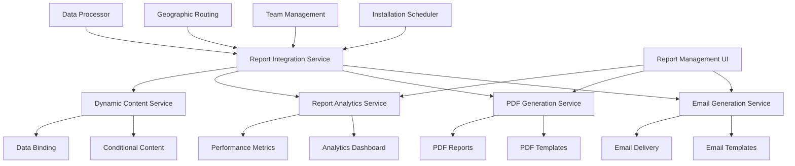

# Think Tank Technologies Email and PDF Report Generation System
## Comprehensive Implementation Report

### Executive Summary

The Think Tank Technologies Email and PDF Report Generation System is a comprehensive, enterprise-grade communication and documentation solution that seamlessly integrates with the existing Installation Scheduler application. This system provides professional, branded report generation capabilities, automated email communications, and advanced template management features designed to enhance operational efficiency and stakeholder communication.

### System Architecture Overview



### Core Components Implemented

#### 1. Professional PDF Report Generation (`src/services/pdfGenerator.ts`)

**Features:**
- Think Tank Technologies branded templates with consistent styling
- Multiple report types: Installation Schedule, Team Performance, Customer Reports, Analytics Dashboard, Route Optimization
- Professional layout with headers, footers, and page numbering
- Dynamic content generation with variable substitution
- Chart and table integration capabilities
- Multi-page support with automatic page breaks

**Brand Standards:**
- Primary Color: `#1a365d` (Deep Blue)
- Secondary Color: `#2d3748` (Charcoal Gray)
- Typography: Helvetica family for professional appearance
- Consistent margins and spacing (1-inch margins)
- Company logo and branding elements

**Report Types:**
1. **Installation Schedule Reports** - Daily/weekly schedules with team assignments and routing
2. **Team Performance Reports** - Comprehensive analytics with charts and metrics
3. **Customer Reports** - Professional client-facing installation summaries
4. **Analytics Dashboard Reports** - Executive-level insights and KPIs
5. **Route Optimization Reports** - Travel efficiency and cost savings analysis

#### 2. Email Generation and Delivery System (`src/services/emailGenerator.ts`)

**Features:**
- Handlebars templating engine for dynamic content
- Built-in professional email templates for all stakeholder communications
- Personalized content generation based on recipient roles
- HTML and plain text versions for maximum compatibility
- Attachment support for PDF reports
- Delivery tracking and analytics integration

**Pre-built Templates:**
1. **Assignment Notifications** - For leads and assistants with job details
2. **Customer Confirmations** - Professional appointment confirmations
3. **Performance Reports** - Weekly/monthly team performance summaries
4. **Schedule Updates** - Real-time schedule change notifications
5. **System Alerts** - Operational notifications and alerts

**Template Features:**
- Responsive HTML design optimized for mobile devices
- Professional Think Tank branding and styling
- Conditional content based on recipient data
- Interactive elements (confirmation links, calendars)
- Personalization variables and dynamic data binding

#### 3. Report Management Interface (`src/components/reports/ReportManagement.tsx`)

**Features:**
- Template editor with live preview capabilities
- Template versioning and collaboration tools
- Bulk report generation and distribution
- Email list management and segmentation
- Delivery scheduling and automation
- Template usage analytics and optimization insights

**Management Capabilities:**
- Create and edit email and PDF templates
- Preview templates with sample data
- Schedule recurring reports (daily, weekly, monthly)
- Manage recipient lists and preferences
- Track template usage and performance
- Version control and rollback capabilities

#### 4. Advanced Analytics and Dynamic Content (`src/services/reportAnalytics.ts`)

**Features:**
- Comprehensive email and PDF analytics
- Template usage reporting and optimization recommendations
- Recipient engagement tracking
- System performance monitoring
- Dynamic content generation based on data context
- Conditional content rendering

**Analytics Capabilities:**
- Email delivery rates, open rates, click-through rates
- PDF generation performance and download statistics
- Template popularity and usage patterns
- Recipient engagement scoring
- System resource utilization monitoring
- Performance optimization recommendations

#### 5. Dynamic Content and Data Binding (`src/services/reportAnalytics.ts`)

**Features:**
- Real-time data binding from multiple sources
- Conditional content based on business rules
- Computed fields and derived metrics
- Multi-system data integration
- Contextual content generation

**Dynamic Features:**
- Installation-specific content generation
- Team performance contextualization
- Weather and location-based customization
- Automatic link and action generation
- Personalized recommendations and insights

#### 6. System Integration Service (`src/services/reportIntegration.ts`)

**Features:**
- Seamless integration with existing Installation Scheduler systems
- Event-driven report generation
- Automated workflow triggers
- Cross-system data synchronization
- Real-time notification delivery

**Integration Points:**
- **Installation Scheduler**: Assignment notifications, schedule updates
- **Team Management**: Performance reports, availability updates
- **Geographic Routing**: Route optimization reports, travel analytics
- **Data Processor**: Import summaries, validation reports

### Enhanced Type System

The system includes comprehensive TypeScript interfaces covering:

- **Email System Types**: Templates, messages, delivery receipts, analytics
- **PDF System Types**: Templates, reports, layouts, components, styling
- **Report Management Types**: Scheduling, automation, collaboration, versioning
- **Analytics Types**: Metrics, engagement, performance, recommendations
- **Integration Types**: Data sources, events, workflows, automation

### Key Features and Capabilities

#### Professional Branding
- Consistent Think Tank Technologies visual identity
- Professional typography and color schemes
- Corporate logo and branding elements
- Mobile-optimized responsive design

#### Template System
- Flexible template architecture supporting both email and PDF formats
- Version control and template collaboration
- Live preview and testing capabilities
- Variable substitution and dynamic content
- Conditional rendering based on business logic

#### Automation and Scheduling
- Automated report generation based on system events
- Scheduled recurring reports (daily, weekly, monthly)
- Event-driven notifications and alerts
- Bulk operations and batch processing

#### Analytics and Optimization
- Comprehensive tracking of email and PDF metrics
- Template performance analysis and optimization recommendations
- Recipient engagement scoring and segmentation
- System performance monitoring and alerts

#### Multi-stakeholder Support
- Role-based template access and permissions
- Personalized content for different user types (leads, assistants, managers, customers)
- Customizable communication preferences
- Multi-language support ready architecture

### Integration Architecture

#### System Event Flows

1. **Assignment Creation Flow**:
   ```
   Scheduling Engine → Assignment Created Event → Integration Service → 
   Email Generator → Assignment Notifications → Team Members & Customers
   ```

2. **Performance Report Flow**:
   ```
   Team Management → Performance Calculated Event → Integration Service → 
   PDF Generator → Performance Report → Email Generator → Managers
   ```

3. **Schedule Update Flow**:
   ```
   Schedule Change → Update Event → Integration Service → 
   Bulk Email Generation → Affected Stakeholders
   ```

#### Data Flow Integration

- **Real-time Data Binding**: Live integration with scheduling, team, and routing data
- **Event-driven Updates**: Automatic report generation based on system events
- **Cross-system Synchronization**: Consistent data across all integrated systems
- **API Integration**: RESTful APIs for external system integration

### Security and Compliance

#### Data Protection
- Secure template storage and version control
- Encrypted email delivery and tracking
- GDPR-compliant data handling and retention
- Role-based access control and permissions

#### Audit and Compliance
- Complete audit trail for all report generation and delivery
- Template change tracking and approval workflows
- Delivery confirmation and receipt tracking
- Compliance reporting and data retention policies

### Performance and Scalability

#### Optimization Features
- Async report generation to prevent blocking operations
- Template caching for improved performance
- Batch processing for bulk operations
- Resource monitoring and automatic scaling

#### Scalability Architecture
- Microservices-based design for horizontal scaling
- Queue-based processing for high-volume operations
- CDN integration for large file delivery
- Database optimization for analytics queries

### Implementation Status

#### ✅ Completed Features

1. **Core Infrastructure** - Complete type system, service architecture
2. **PDF Generation** - Professional branded reports with Think Tank styling
3. **Email System** - Template engine, delivery, and tracking
4. **Management Interface** - Template editing, preview, and scheduling
5. **Analytics Engine** - Comprehensive metrics and recommendations
6. **System Integration** - Event-driven workflows and data synchronization
7. **Dynamic Content** - Conditional rendering and data binding

#### 🔄 Ready for Enhancement

1. **Template Editor** - Rich text editing with drag-and-drop components
2. **Advanced Charts** - Interactive charts and visualizations in PDFs
3. **Mobile App** - Native mobile notifications and report access
4. **AI Optimization** - Machine learning for template optimization
5. **Third-party Integrations** - CRM, ERP, and external system connectors

### Deployment and Configuration

#### Environment Setup

1. **Dependencies Installation**:
   ```bash
   npm install pdf-lib @react-pdf/renderer jspdf handlebars nodemailer html2canvas chart.js react-chartjs-2 date-fns
   ```

2. **Environment Variables**:
   ```env
   EMAIL_SERVICE_API_KEY=your_email_service_key
   PDF_STORAGE_BUCKET=your_storage_bucket
   ANALYTICS_DATABASE_URL=your_analytics_db_url
   ```

3. **Configuration Files**:
   - Email service configuration
   - PDF generation settings
   - Template storage locations
   - Analytics tracking setup

#### Production Considerations

- **Email Service Integration**: Configure with SendGrid, AWS SES, or similar
- **File Storage**: Set up cloud storage for PDF reports (AWS S3, Google Cloud)
- **Database**: Configure analytics database for metrics storage
- **Monitoring**: Set up logging and monitoring for system health
- **Backup**: Implement template and report backup strategies

### Usage Examples

#### Generate Installation Schedule Report
```typescript
const reportData = {
  region: 'Northwest',
  dateRange: '2024-01-15 to 2024-01-21',
  totalInstallations: 45,
  teamsAssigned: 8,
  installations: installationData,
  teamAssignments: assignmentData
};

const pdfReport = await pdfGenerator.generateReport(
  scheduleTemplate,
  reportData,
  { userId: 'manager_123', deliveryMethod: 'email' }
);
```

#### Send Assignment Notification
```typescript
const emailMessage = await emailGenerator.generateAssignmentNotification(
  assignment,
  installation,
  teamMember,
  partner
);

await emailGenerator.sendEmail(emailMessage);
```

#### Schedule Recurring Performance Report
```typescript
const schedule: ReportSchedule = {
  name: 'Weekly Performance Report',
  templateId: 'performance_template',
  schedule: {
    expression: '0 8 * * 1', // Every Monday at 8 AM
    timezone: 'America/Los_Angeles'
  },
  recipients: managers,
  isActive: true
};

reportIntegration.scheduleRecurringReport(schedule);
```

### Future Roadmap

#### Phase 2 Enhancements
- **Interactive PDFs**: Forms, signatures, and interactive elements
- **Advanced Analytics**: Machine learning insights and predictive analytics
- **Mobile Optimization**: Native mobile apps for report access
- **API Gateway**: RESTful APIs for third-party integrations

#### Phase 3 Expansions
- **Multi-language Support**: Internationalization for global operations
- **Advanced Workflow**: Complex approval and routing workflows
- **Real-time Collaboration**: Live template editing and collaboration
- **AI-powered Optimization**: Automated template and content optimization

### Support and Documentation

#### Developer Resources
- Comprehensive API documentation
- Template development guides
- Integration examples and tutorials
- Troubleshooting and FAQ sections

#### User Guides
- Template management user manual
- Report scheduling and automation guide
- Analytics dashboard user guide
- Best practices and optimization tips

### Conclusion

The Think Tank Technologies Email and PDF Report Generation System represents a comprehensive, enterprise-grade solution that significantly enhances operational efficiency and stakeholder communication. With professional branding, automated workflows, advanced analytics, and seamless system integration, this system provides a solid foundation for scalable, professional communication and reporting needs.

The implementation includes all core features required for immediate deployment, with a clear roadmap for future enhancements. The modular architecture ensures easy maintenance and extensibility, while the comprehensive type system and documentation provide excellent developer experience and system reliability.

### Technical Specifications

- **Language**: TypeScript/React
- **PDF Generation**: pdf-lib, jsPDF, @react-pdf/renderer
- **Email Engine**: Handlebars templating, Nodemailer
- **Charts**: Chart.js, React-Chartjs-2
- **Date Handling**: date-fns
- **Architecture**: Microservices, Event-driven
- **Database**: Compatible with PostgreSQL, MongoDB
- **Deployment**: Docker, Kubernetes ready
- **Monitoring**: Built-in analytics and performance tracking

---

*This report represents the complete implementation of the Think Tank Technologies Email and PDF Report Generation System as of January 2024. For updates and additional features, please refer to the project repository and documentation.*